**Behavioral Cloning Project**

This is my implementation of Udacity self driving car, project 3, behavioral project

This markdown lists how I arrived at my submission during my enrollment, and I improved since then

The goals / steps of this project, as specified in Udacity:
* Use the simulator to collect data of good driving behavior
* Build, a convolution neural network in Keras that predicts steering angles from images
* Train and validate the model with a training and validation set
* Test that the model successfully drives around track one without leaving the road
* Summarize the results with a written report

# How to run the model
* python drive.py model.h5
* Run driving simulator
    * Simulator can be obtained here: https://github.com/udacity/self-driving-car-sim

# Attempt #1: What was submitted during the course
## Architecture of the neural network
* PreProcess
    * lambda: Grayscale and normalization layer: mean of RGB, then normalize to [-0.5, 0.5]
    * Crop: Drop top 65 and bottom 15
* Convolution
    * Convolution: filter size 6, kernel size 5, stride 1, padding valid
    * Max pool: 2x2
    * Convolution: filter size 6, kernel size 5, stride 1, padding valid
    * Max pool: 2x2
    * Convolution: filter size 6, kernel size 5, stride 1, padding valid
    * Max pool: 2x2
* Dense layer
    * Flatten
    * Dense: 40 relu neurons, normal random initialization with 0 mean 0.5 std dev. L2 regularization
    * Dropout applied here
    * Dense: 30 linear neurons, normal random initialization with 0 mean 0.5 std dev. L2 regularization
    * Dense: 10 linear neurons, normal random initialization with 0 mean 0.5 std dev. L2 regularization
    * Dense: 1 linear neurons, normal random initialization with 0 mean 0.5 std dev. L2 regularization
* The output of the last dense layer is the steering angle predicted by the network
* Loss function: predicted steering angle vs output
* optimizer: Adam optimizer was used

The last layer is linear, as we want an angle most of the time. Relu is either 0 or linear.

All relu layer was used as an experimentation, but it did not deliver better results than linear.

Udacity suggested a CNN + NVIDIA neural network model. The detail of NVIDIA neural network model is here: https://images.nvidia.com/content/tegra/automotive/images/2016/solutions/pdf/end-to-end-dl-using-px.pdf

With my machine capacity, it was a challange to train such a complicated model, however.

NVIDIA model is for a self driving car. In contrast, my model needs to only predict a steering angle. Realizing this, I changed the model to something smaller: LeNet

## Model Architecture

Here is a visualization of the architecture

## Training data
Data which was provided by the course was used : driving_log_udacity.py

I tried creating my own training data, but it resulted in a worse model.

Apparently I am not a good example for the model to be trained on.

## Training process

To avoid overfitting, the following techniques were used
* Dropout of 50% in the neural network layer
* Augmentation: In fact, training was done only with augmented images
* Early stopping with patience of 3 epochs

## Augmentation done
Augmentation was used not only to generate more training data, but also force generalization of the model

The following augmentation was applied during training
* flip: An image was randomly flipped, along with its angle. This was suggested by Udacity
* black out: Either the left or right 60% of the image was blacked out. This forced the network to predict angle based on one side of the image. In fact, this is similar to how humans drive. If a lane marking on one side of the road is unclear, a human driver would drive based on the other side

## Result
The resulting model performed well on the first track. The following is a video of how the model navigates through the course. A short manual intervention was done (around 3:22) to make the car go the opposite direction

Unfortunately, the model couldnt drive through the second track. It was rather willing to jump off the cliff.

What went well:
* Developed a model which can be trained within an hour on a desktop GPU
* Used minimum amount of data (Used only what was provided by Udacity)

What didnt go well:
* Model is not general enough. It fails to drive on the second course
* Model does not (yet) know how to recover. It is not shown on the video, but when situated perpendicular to the lane, the model drove over the lane

# Attempt #2: Improving and Generalization
## Failure Analysis: Lack of data on the second track
The initial analysis of the failure on the second track was the lack of training data. As such, driving data from the second data was added to the training data. Surprisingly, this did not improve the model at all. Rather, it worsened the performance on the first track as well, driving the car out of lane

## Failure Analysis #2: Unbalanced data
It was noticed at this point that the data is unbalanced. The histogram below shows the distribution of angles of training data

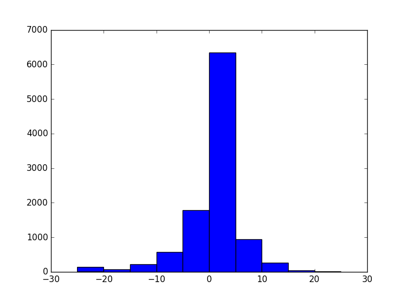

The histogram shows the below:

* The model might have a right turn bias. Most of data is > 0. Indeed, the model did not go left enough when it ran out of the lane in failure analysis #1. Realizing this, the model was ran through the same section, but in a different direction. That went better!

* Most of data is near 0. This explains why the model is not taking sharp turns when it should

Based on the above analysis, the training data was balanced based on angles. Between dropping data and adding more data of minorities, the latter was chosen. The amount of data between minority and majority was wide enough that dropping to fit the minority would have resulted in lack of training data. The logic for balancing is in balance.py. As the model has randomized augmentation logic, training data in minority sets were added as is.

Result: That went better! And the model is able to drive through the first course. Still fails on the second track, however

# Attempt #3: Optimizing Augmentation

## Failure Analysis: Shadow
Running the model through the second track, the model drove to a wrong side, whenever a shadow is present. This looked related to BlackoutAug, which was forcing the car to drive with the half of the screen black.

Realizing this, it became clear that the augmentation strategy has to be restablished. The second track contained some unique features which could confuse the model.

* Shadow: Due to varying brightness, the line could appear darker or brigher. BrightnessAug was to counter this, making the image darker or brighter
* Dotted Line: The second track has dotted line, which is the model assumed not OK to cross. DottedlineAug was added, drawing a dotted white line to random locations of the screen. The assumption was that, this would help the model to learn to ignore the white dotted line

Also, another dense layer was as there was a persistent gap in the training loss and the validation loss.

## Optimization: Training time
At this point, the model was getting trained with 77000s of images per epoch, each epoch taking nearly 4 hours.

This is when I convered all linear activations to the relu activations, except the last layer. Relu shows the same behavior as a linear activation above threshold, but outputs 0 below the threshold. This property can help with the training time by making the network sparse, reducing the amount of computations.

The conversion reduced the training time to 3 hours.

## Resulting model
Here is how the resulting model drove. It was doing better, until it ran into a sharp curve.

# Attempt #4: Corner Case

The resulting model was doing better, but it was consistently failing to make a sharp turn. It appeared that the model is not sure what to do if it is too close to the lane marking. This is more apparent when the model predicts a left turn close to the curve.

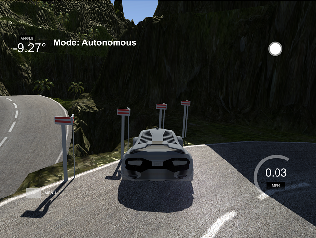

To train the model how to get through a sharp turn, StretchAug was modified to not only enlarge the image, but also to reduce the image. The reduced image makes a regular curve appear more sharp

| Pre-stretch | Post-stretch |
| ------------- |:-------------:|
| 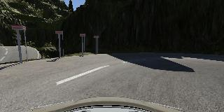 | 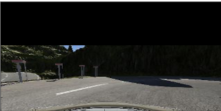 |

# Final
Training with the enhanced StretchAug, the model finally became capable of driving both tracks!

The below recaps the model and augmentations

### List of augmentations

Note: BrightnessAug should have been the last augmentation, but the training of final_model.h5 was done without this bug fixed

The table below lists augmentations done, and an example of applying each individually

| Augmentation Name | Probability | Behavior | EG |
| ------------- |:-------------:| -----:| -----:|
| Original Image | N/A | N/A | |
| FlipAug | 50% | Flips the image and returns angle * -1 | 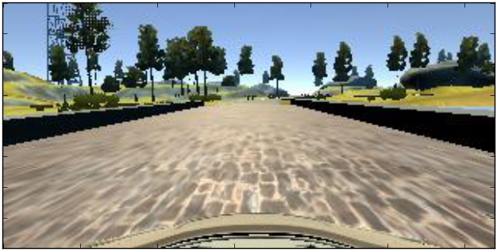|
| RoadsignAug | 100% | Draws a grey straight line outside of the road | 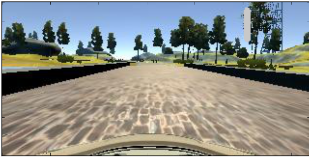|
| ShadowAug | 100% | Draws a 50% transparent black polygon of a random shape (3-8 vertices) | 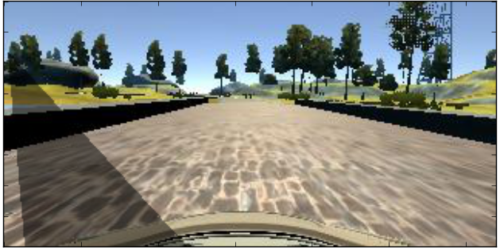|
| DottedLineAug | 100% | Draws a white dotted line on a random location of the image | 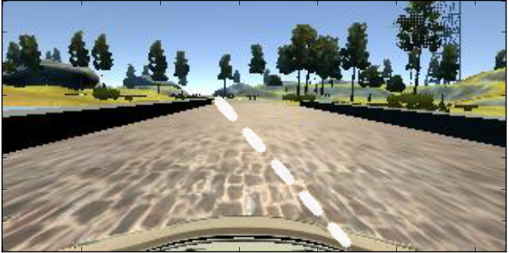|
| StretchAug | 100% | Enlarges or reduces the image by stretching up to +-40%. Fills the empty region black | 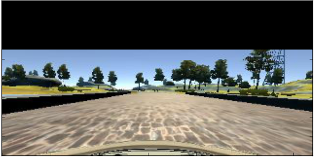|
| Brightness | 100% | Make the image up to 75% brighter or darker | 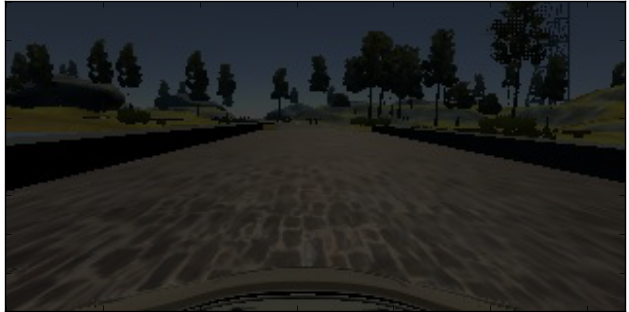|

### Final Model Architecture
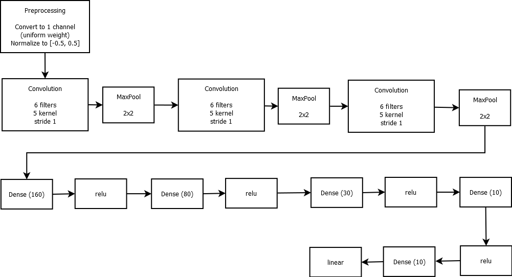

### Resulting video

