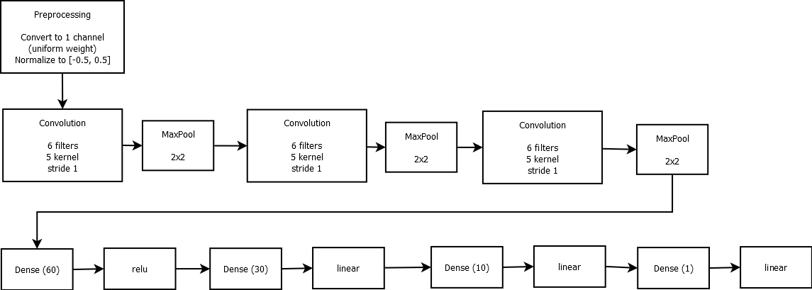

**Behavioral Cloning Project**

This is my implementation of Udacity self driving car, project 3, behavioral project

This markdown lists how I arrived at my submission during my enrollment, and I improved since then

The goals / steps of this project, as specified in Udacity:
* Use the simulator to collect data of good driving behavior
* Build, a convolution neural network in Keras that predicts steering angles from images
* Train and validate the model with a training and validation set
* Test that the model successfully drives around track one without leaving the road
* Summarize the results with a written report

# How to run the model
* python drive.py model.h5
* Run driving simulator
    * Simulator can be obtained here: https://github.com/udacity/self-driving-car-sim

# Attempt #1: What was submitted during the course
## Architecture of the neural network
* PreProcess
    * lambda: Grayscale and normalization layer: mean of RGB, then normalize to [-0.5, 0.5]
    * Crop: Drop top 65 and bottom 15
* Convolution
    * Convolution: filter size 6, kernel size 5, stride 1, padding valid
    * Max pool: 2x2
    * Convolution: filter size 6, kernel size 5, stride 1, padding valid
    * Max pool: 2x2
    * Convolution: filter size 6, kernel size 5, stride 1, padding valid
    * Max pool: 2x2
* Neural network
    * Flatten
    * Dense: 40 relu neurons, normal random initialization with 0 mean 0.5 std dev. L2 regularization
    * Dropout applied here
    * Dense: 30 linear neurons, normal random initialization with 0 mean 0.5 std dev. L2 regularization
    * Dense: 10 linear neurons, normal random initialization with 0 mean 0.5 std dev. L2 regularization
    * Dense: 1 linear neurons, normal random initialization with 0 mean 0.5 std dev. L2 regularization
* The output of the last dense layer is the steering angle predicted by the network
* Loss function: predicted steering angle vs output
* optimizer: Adam optimizer was used

The last layer is linear, as we want an angle most of the time. Relu is either 0 or linear.

All relu layer was used as an experimentation, but it did not deliver better results than linear.

Udacity suggested a CNN + NVIDIA neural network model. The detail of NVIDIA neural network model is here: https://images.nvidia.com/content/tegra/automotive/images/2016/solutions/pdf/end-to-end-dl-using-px.pdf

With my machine capacity, it was a challange to train such a complicated model, however.

NVIDIA model is for a self driving car. In contrast, my model needs to only predict a steering angle. Realizing this, I changed the model to something smaller: LeNet

## Final Model Architecture

Here is a visualization of the architecture

## Training data
Data which was provided by the course was used : driving_log_udacity.py

I tried creating my own training data, but it resulted in a worse model.

Apparently I am not a good example for the model to be trained on.

## Training process

To avoid overfitting, the following techniques were used
* Dropout of 50% in the neural network layer
* Augmentation: In fact, training was done only with augmented images
* Early stopping with patience of 3 epochs

## Augmentation done
Augmentation was used not only to generate more training data, but also force generalization of the model

The following augmentation was applied during training
* flip: An image was randomly flipped, along with its angle. This was suggested by Udacity
* black out: Either the left or right 60% of the image was blacked out. This forced the network to predict angle based on one side of the image. In fact, this is similar to how humans drive. If a lane marking on one side of the road is unclear, a human driver would drive based on the other side

## Result
The resulting model performed well on the first track. The following is a video of how the model navigates through the course. A short manual intervention was done (around 3:22) to make the car go the opposite direction

Unfortunately, the model couldnt drive through the second track. It was rather willing to jump off the cliff.

What went well:
* Developed a model which can be trained within an hour on a desktop GPU
* Used minimum amount of data (Used only what was provided by Udacity)

What didnt go well:
* Model is not general enough. It fails to drive on the second course
* Model does not (yet) know how to recover. It is not shown on the video, but when situated perpendicular to the lane, the model drove over the lane
